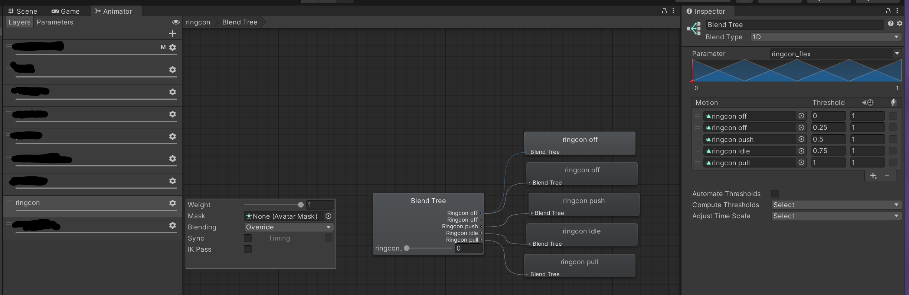

# osc-ringcon

VRChatでRing-Conを使うのアップ。

Use your Ring-Con in VRChat.

This program connects your Ring-Con to VRChat using Bluetooth and OSC.

## Avatar setup

Add a ring to your avatar. You probably want to define shape keys for squeezed and pulled.

Create four animations:
1. Ring is hidden.
2. Ring is shown in its normal position.
3. Ring is shown and squeezed to its maximum extent.
4. Ring is shown and pulled to its maximum extent.

Create an avatar parameter called `ringcon_flex` with type `Float` and a default of `0`.

Create a new animation controller layer which uses this parameter to drive a blend tree. In the blend tree,
- Configure both 0.0 and 0.5 to be the hidden animation.
- Configure 1.0 to be the squeezed animation.
- Configure 2.0 to be the shown and idle animation.
- Configure 3.0 to be the pulled animation.

### Tip

Add an expression menu which resets the parameter to 0.

## Usage

1. Pair the Joy-Con to your computer.
2. Start the program and insert the Joy-Con into the Ring-Con.

The program will translate the Joy-Con state into numbers between 1.0 and 3.0 and send them to `/avatar/parameters/ringcon_flex`.

## Troubleshooting

### The Joy-Con is paired but won't connect to the PC

Try holding the pair button until the lights start blinking. Release the pair button and then press the SR button.

### The Ring-Con is connected, but not detected

Press the pair button on the Joy-Con to turn it off. Turn it back on and try again.

### The window is blank or there is no text on it

Make sure the `res` folder is present next to `osc-ringcon.exe`.

## Known issues

- The player LED on the Joy-Con often keeps animating as if the Joy-Con is not connected.
- If the Ring-Con is disconnected from the Joy-Con, it may not be redetected without restarting the Joy-Con.
- The Joy-Con sometimes disconnects itself from Windows, and getting it to connect can be difficult.
- Parameters are not configurable without modifying the code.
- 日本語の訳はとても悪いです。
